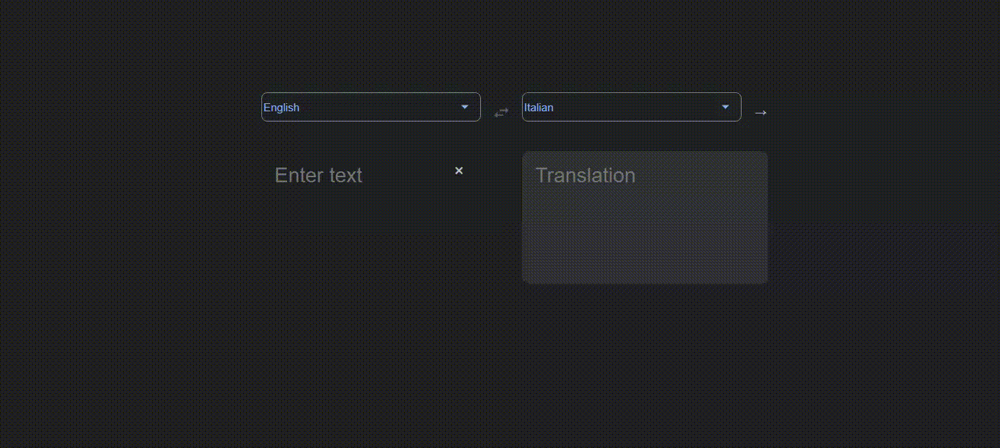

# Clone del Traductor de google



## Description

Clone del traductor de google con la api de google translate de rapidApi.
Realizado con React, Node, Express, Axios

## Uso

1 - instalar node_modules en la raiz del proyecto

```
npm install
```

Luego correr en la carpeta del proyecto el siguiente comando.

```bash
npm run start:frontend
```

```bash
npm run start:backend
```
